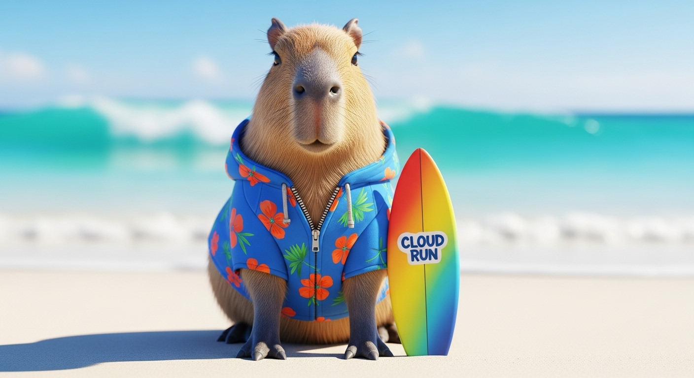

# Gemini CLI for Video Generation

An experimental demonstration of using [MCP Servers for Genmedia](https://github.com/GoogleCloudPlatform/vertex-ai-creative-studio/tree/main/experiments/mcp-genmedia/sample-agents/geminicli)
in [Gemini CLI](https://github.com/google-gemini/gemini-cli)
with planned iterative ideation and media generation.



It uses Imagen 4 and Veo 3 models through **MCP Servers for Genmedia**.

It also edits images using `gemini-2.5-flash-image-preview` model (aka nano-🍌) for character and scene consistency.

Demo video: [TODO](https://youtube.com)

## How to try

0. Install [gcloud CLI](https://cloud.google.com/sdk/docs/install) and [Gemini CLI](https://github.com/google-gemini/gemini-cli?tab=readme-ov-file#-installation).

    > If you didn't use Google Cloud before, get a [free trial](https://cloud.google.com/free?utm_campaign=CDR_0xc245fc42_default_b433386287&utm_medium=external&utm_source=blog).

   If `gcloud auth print-identity-token -q` CLI command result is empty,
   run `gcloud auth login --update-adc`.

1. [Enable Vertex AI APIs](https://console.cloud.google.com/vertex-ai/dashboard?utm_campaign=CDR_0xc245fc42_default_b433386287&utm_medium=external&utm_source=blog) in your project.

**NOTE:** From here, you can ask Gemini CLI to perform steps 2 to 5 for you.
Simply run `gemini`, choose **Vertex AI** authentication option, and ask it to perform steps 2 to 5 from the instructions below. Sometimes, it may need your help 🙂

2. Clone [Vertex AI Creative Studio repository](https://github.com/GoogleCloudPlatform/vertex-ai-creative-studio) inside this repo's clone:

    ```bash
    git clone https://github.com/GoogleCloudPlatform/vertex-ai-creative-studio
    ```

3. [Install](https://github.com/GoogleCloudPlatform/vertex-ai-creative-studio/blob/main/experiments/mcp-genmedia/mcp-genmedia-go/README.md#getting-started-installation) MCP Servers for Genmedia.

4. [Create a Cloud Storage Bucket](https://console.cloud.google.com/storage/create-bucket?utm_campaign=CDR_0xc245fc42_default_b433386287&utm_medium=external&utm_source=blog), and give `Vertex AI Service Agent` service account read and write access to the bucket.

    > Vertex AI Service Agent is `service-PROJECT_NUMBER@gcp-sa-aiplatform.iam.gserviceaccount.com` account PROJECT_NUMBER is your project's number.
    You can give it access on `Permissions` tab of your bucket's page.
    Project number can be found [here](https://console.cloud.google.com/iam-admin/settings?utm_campaign=CDR_0xc245fc42_default_b433386287&utm_medium=external&utm_source=blog).

5. Clone this repository (finally!):

    ```bash
    git clone https://github.com/vladkol/gemini-cli-media-generation
    cd gemini-cli-media-generation
    ```

6. Create `.env` file with your Google Cloud Project Id, location/region, and the bucket name.
Use `.env.template` as a starter.

7. [Configure](https://github.com/GoogleCloudPlatform/vertex-ai-creative-studio/tree/main/experiments/mcp-genmedia/sample-agents/geminicli) MCP Servers in Gemini CLI. Use [.gemini/settings.sample.json](.gemini/settings.sample.json) as a starter (we only need Imagen, Veo and AVTool servers).

8. Delete or rename the following sub-directories:

    * `generated_images`
    * `generated_videos`
    * `prompts`

    They are here as an example.

9. Run **a new session** of Gemini CLI - `gemini`

10. Ask it to create a video based on your idea!

## NOTE

This project is a demonstration of vibe coding intended to provide an example with verification through human feedback.
The goal is to show an idea for further development.
It is not intended for use in a production environment.

All media assets and code in this repository are AI generated.
